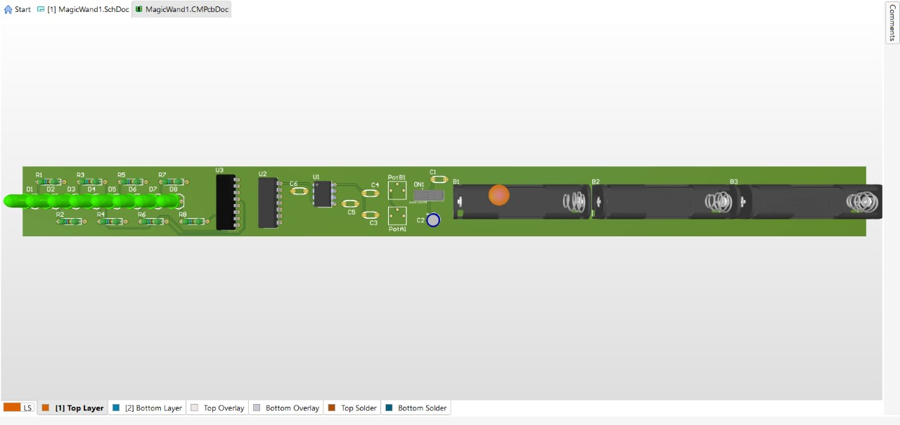

# Magic Wand PCB

## Overview
This project is a custom printed circuit board designed in Altium Circuit Maker that functions as a "Magic Wand". By waving the board in the air, the sequential flashing of the LEDs creates a Persistence of Vision (POV) effect. 

## Circuit Details
* **Clock Signal:** A 555 timer generates an adjustable clock pulse (controlled via onboard potentiometers).
* **Binary Counter:** An SN74HC161N 4-bit counter tracks the pulses.
* **Decoder/Driver:** A CD74HC138E 3-to-8 decoder interprets the binary count to sequentially drive 8 LEDs.

## Project Structure
* `/Docs`: Contains schematic (`image_2026-06-14_18-36-40.jpg`) and PCB routing layout (`image_2026-06-14_18-46-59.jpg`).
* `/Hardware`: Contains the Altium Circuit Maker design files and BOM (Bill of Materials).
* `/Manufacturing`: Contains generated Gerber and NC Drill files ready for fabrication.
