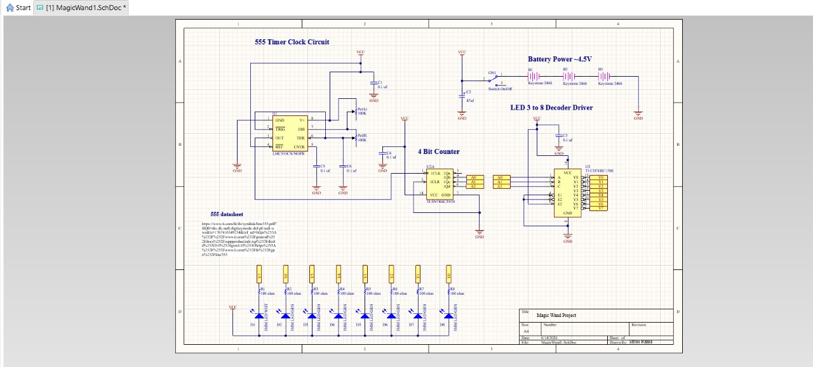
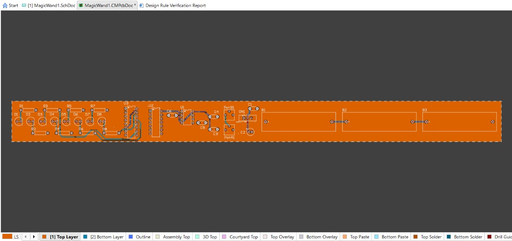

# 🪄 Magic Wand PCB

  

## Overview
This repository contains the hardware design files for a custom "Magic Wand" printed circuit board. By waving the board through the air, the sequential flashing of the onboard LEDs creates a continuous light trail via the **Persistence of Vision (POV)** effect.

### Features
* **Adjustable Speed:** Dual 100K onboard potentiometers allow real-time tuning of the 555 timer clock frequency.
* **Sequential LED Chaser:** Hard-coded logic sequences 8 LEDs without the need for a microcontroller or firmware.
* **Battery Powered:** Powered entirely by a 4.5V supply via a 3x AAA battery array mounted directly to the PCB.

---

## Circuit Architecture

  
  

1. **Clock Generation:** An `LMC555CN` timer generates a continuous, tunable square wave.
2. **Binary Counter:** An `SN74HC161N` 4-bit counter receives the clock pulses and counts upward in binary.
3. **Decoder/Driver:** A `CD74HC138E` 3-to-8 active-low decoder interprets the 3 least significant bits from the counter, sinking current to sequentially illuminate the LEDs (1 White, 7 Green).

---

## Bill of Materials (BOM)

| Designator | Value / Part | Description | Qty |
|---|---|---|---|
| B1, B2, B3 | Keystone 2466 | AAA Battery Holder (PC Mount) | 3 |
| C1 | 47µF | Electrolytic Capacitor (16V) | 1 |
| C2-C6 | 0.1µF | Ceramic Capacitor (104) | 5 |
| D1 | 5mm White LED | T-1 3/4 Through-hole LED | 1 |
| D2-D8 | 5mm Green LED | T-1 3/4 Through-hole LED | 7 |
| ON1 | Slide Switch | 3-Pin THD On/Off Switch | 1 |
| PotA1, PotB1 | 100K | Trimmer Potentiometer | 2 |
| R1-R8 | 100Ω | Carbon Film Resistor (1/4W) | 8 |
| U1 | LMC555CN | 555 Timer IC (CMOS) | 1 |
| U2 | SN74HC161N | 4-Bit Binary Counter | 1 |
| U3 | CD74HC138E | 3-to-8 Line Decoder | 1 |

---

## Directory Structure

* `/Docs`: Contains schematic, PCB routing layout, and 3D renders.
* `/Hardware`: Contains the Altium Circuit Maker source files (`.SchDoc`, `.CMPcbDoc`) and the raw BOM CSV.
* `/Manufacturing`: Contains the `.GBR` (Gerber) and NC Drill files.

## Manufacturing
The board is a standard 2-layer FR4 design. To fabricate this PCB:
1. Download the contents of the `/Manufacturing` folder.
2. Zip the Gerber and NC Drill files together.
3. Upload the `.zip` to any standard PCB fabrication house (e.g., JLCPCB, PCBWay, OSH Park).
